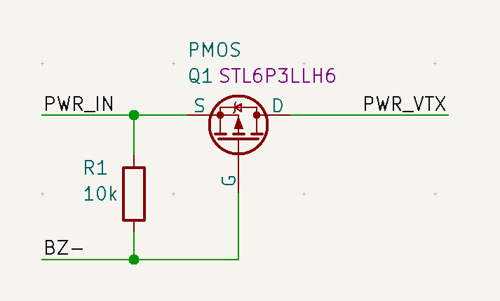

# BD1 "Chimera" repo

**Chimera is 2,2" / 3" freestyle cinewhoop type drone, for 3S/4S batteries, with fully 3D printed construction**

- Ready-to-flight mass(with lamp, battery and wings)
: <200grams
- Carry weight
: Can fly with light action camera
- flight time
: 1,5 - 5min

*\*Speed can be reduced in edgeTX system using logical switch based on the speed read from GNSS, and the mix function. The project includes a configuration that limits the speed when SB is UP*

[**Youtube Video**](https://www.youtube.com/watch?v=lm06ZXMheoQ)

## 3D printing

All on 0.4 brass nozzle, make sure you have at least 5 pieces- CF filaments will wear off quickly. Trim Z-offset after every CF print

I don't recommend using SS nozzle becouse it's too cold for my printer.

### tips/info
>please use proper materials. Drone components will be hot or very hot. Printing parts with PLA or similar will cause melt your construction during flight. **If my cheap Sidewinder X4 printer can handle this materials- yours printer also can.**

>It's not cheap project- don't do it because of lack of funds. Buying a ready frame will be cheaper than buying CF filaments

>one battery for one 2-3 minutes flight. Make sure you have more than 1

### parts
- **ducts**
: PA12. after print heat and bend down the wing trims by 90 degrees
- **frame**
: PC-CF/PETG-CF, 2 wall loops, no supports, 100% grid infill, rotate 15deg in Z axis
- **body**
: PA12
- **wings**
: any
- **roof**
: TPU A95
- **GNSS mount**
: TPU A95
- **Grip nuts, sleeves**
: PETG
- **top lock**
: PETG
- **light plate**
: TPU

## BOM

### 3D printed
- 1 x ducts
- 1 x body
- 1 x frame
- 1 x left wing
- 1 x right wing
- 1 x roof or mount roof
- 1 x GNSS mount
- 1 x cable lock
- 4 x camera sleeves
- 4 x sleeve 2mm
- 4 x sleeve 3mm
- 4 x grip nuts
- 1 x light plate
- 16 x 1.2mm sleeve for frame30
- 16 x 0.6mm sleeve for frame22

### electronic
- [ ] **FC**
: GEPRC TAKER G4 35A AIO
>you can use any other 35A+, compatible with 3/4S and 25,5mm pitch
- [ ] **propellers 2.2"**
: GEMFAN 2218 3-blade / HQprop 2216 3-blade (1.5mm shaft)
- [ ] **motors 2.2"**
: BETAFPV Lava series 1104 7200KV
- [ ] **propellers 3"**
: HQPROP T3X1.8X3 / HQPROP T3X3
- [ ] **motors 3"**
: flyfishRC FLASH 1404 4500KV
- [ ] **receiver**
: SpeedyBee Nano 2.4G ExpressLRS ELRS Receiver
>or any other ELRS receiver which can fit into modules mounts in body
- [ ] **camera**
: CADDX Ratel Pro
- [ ] **VTX analog**
: TBS Unify Pro32 Nano 5G8
- [ ] **VTX digital**
: BETAFPV P1 Air unit
- [ ] **battery 2.2"**
: LAVA 3S 550mAh 75C
- [ ] **battery 3"**
: LAVA II 4S 680mAh 95C
- [ ] **GNSS**
: Foxeer M10Q-180 compass- mount on **right** fame spoke, faced antenna up and socket left(to body)
- [ ] **Controller**
: RM Pocket, or any other with ELRS and edgeTX
- [ ] **Goggles**
: BETAFPV VR03 or any other analog goggles
- [ ] **VRX antenna**
: Any RHCP antenna
- [ ] **Charger**
: iMax B6 V2 with some 12V supplier / ToolkitRC Q4AC
- [ ] **5A car fuse and cable socket**
: charging fuse
- [ ] **4x RGB LED**
: if you want make night flies
- [ ] **2 x additional XT30 connectors set**
: to connect battery to charger and FC
- [ ] **red and black 18AWG silicon wire cables**
: to make connection with FC
- [ ] **25-30A car fuse and cable socket**
: not necessary, but recommended
- [ ] **14x9x5 (diameter * hole * height) ferrite ring**
: turn 3-4x GNSS cable as close as possible to GNSS modulestabilizer

### mechanical

- [ ] 1x 10x130mm battery velcro strap
- [ ] 8x 20mm M2 screws with barrel head for stack mount, and wing mount
>make sure you have spares- these screws can bend after hard landing :joy:
- [ ] 4x 10mm M2 screws with barrel head for body mount
- [ ] 12x M2 H3 D3.6mm brass insert
>you can recover it from broken parts, but make sure you have spares
- [ ] 4x M2 1,6mm nut to lock stack screws
- [ ] 4x M2 20mm PA screws to mount digital VTX
- [ ] 4x M2 0,8mm nut to screw in digital VTX
- [ ] 16x M2 8mm screws for frame30
- [ ] 16x M2 6mm screws for frame22

## electronics
project contains configuration for HD version with BZ- pin used as VTX power switch. Implementation below:

## firmware
If you are building remotely:
> choose analog OSD Protocol and type **OSD_HD** in custom defines, to build firmware with both- digital and analog OSD 
> In other options add **Magnetometers**, **Position Hold** and **Altitude Hold**

Firmware notice

This repository may include firmware binaries and configuration files for flight controllers and ESCs.

Betaflight firmware is licensed under the GNU General Public License v3.0 (GPL-3.0).
Source code is available at: https://github.com/betaflight/betaflight
Bluejay ESC firmware is an open-source project.
Source code is available at: https://github.com/bird-sanctuary/bluejay

All respective rights belong to the original authors.
This repository does not claim ownership of these projects and only redistributes unmodified binaries for convenience.

*BD1 stands for "Bart's Design 1"*
