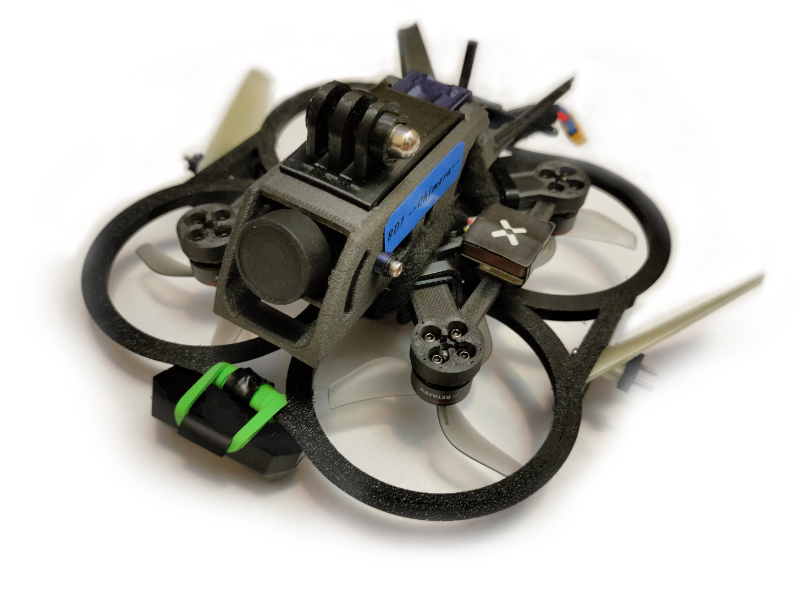
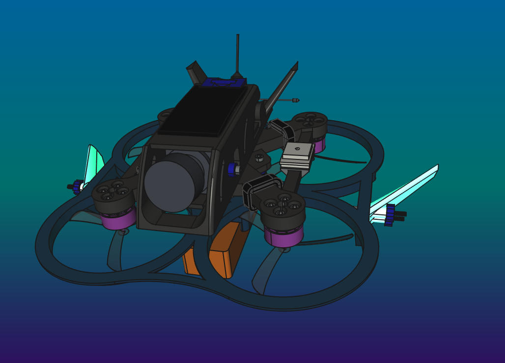
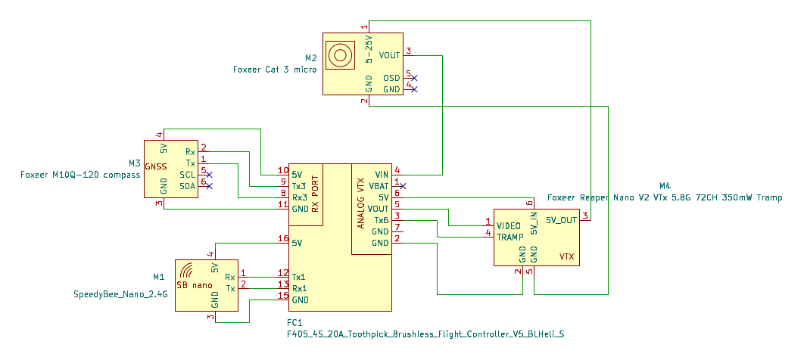

# BD1 "Chimera" repo

**Chimera is 2,2" freestyle cinewhoop type drone, for 3S batteries, with fully 3D printed construction**

- vmax
: >80km/h on full power*
- Ready-to-flight mass(with lamp, battery and wings)
: <220grams
- Carry weight
: Can fly with GoPro camera
- flight time
: 1,5 - 5min
- estimated cost
: 500-550 

*\*Can be reduced in edgeTX system using logical switch based on the speed read from GNSS, and the mix function. The project includes a configuration that limits the speed.*

[**Youtube Video**](https://www.youtube.com/watch?v=lm06ZXMheoQ)

## 3D printing

All on 0.4 brass nozzle, make sure you have at least 5 pieces- CF filaments will wear off quickly. Trim Z-offset after every CF print

I don't recommend using SS nozzle becouse it's too cold for my printer.

### tips/info
>please use proper materials. Drone components will be hot or very hot. Printing parts with PLA or similar will cause melt your construction during flight. **If my cheap Sidewinder X4 printer can handle this materials- yours printer also can.**

>It's not cheap project- don't do it because of lack of funds. Buying a ready frame will be cheaper than buying CF filaments

>one battery for one 2-3 minutes flight. Make sure you have more than 1

### parts
- **duct-light**
: PA6, 3 wall loops, no supports, 20-30% honeycomb infill, rotate 180deg in X axis(upside down)
- **frame**
: PC-CF, 3 wall loops, no supports, 100% grid infill, rotate 35deg in Z axis
- **body**
: PETG-CF, 3 wall loops, tree strong supports, 100% grid infill
>remove supports under side vent pockets, camera axis holes, right tail vent pocket, VTX ant cable hole
- **wings**
: PLA GLOW, 3 wall loops, 80%, no supports, rotate 90deg in Y axis, to make sure base is parallel to table
- **cable mounts**
: TPU A95, 100%, 3 wall loops, X90 deg, Y-45deg
- **roof/mount roof**
: TPU A95, 100%, 3 wall loops, Y90 deg, tree support
>set top support interface spacing 0.2mm to get nice look
- **GNSS mount**
: TPU A95, 3 wal loops, X90 deg
- **Grip nuts, sleeves**
: PETG, 100%
- **cable lock**
: PETG, 100%, X90 deg
- **duct**
: PETG-CF, 3 wall loops, 100% infill
>very robust duct. It make your drone heavier thatn 225grams, but can handle drops from 20 meters into grass

## BOM

### 3D printed
- 1 x duct-light
- 1 x body
- 1 x FDM frame
- 1 x left wing
- 1 x right wing
- 4 x cable mount
- 1 x roof or mount roof
- 1 x GNSS mount
- 1 x cable lock
- 4 x camera sleeves
- 4 x FC sleeves 2mm
- 4 x FC sleeves 3mm
- 4 x grip nuts

### electronic
- [ ] **FC**
: BETAFPV F405 4S 20A Toothpick Brushless Flight Controller V5 BLHeli_S (ICM42688) **or** GEPRC TAKER G4 35A AIO
>you can use any other 20A+, compatible with 3S and 25,5mm pitch
- [ ] **propellers**
: GEMFAN 2218 3-blade Propellers (1.5mm shaft)
- [ ] **motors**
: BETAFPV Lava series 1104 | 7200KV Brushless Motors
- [ ] **receiver**
: SpeedyBee Nano 2.4G ExpressLRS ELRS Receiver
>or any other ELRS receiver which can fit into modules mounts in body
- [ ] **camera**
: Foxeer Cat 3 Micro(19x19mm) or other analog camera
- [ ] **VTX**
: Foxeer Reaper Nano V2 VTx 5.8G 72CH 350mW Tramp
- [ ] **Video antenna**
: Walksnail Avatar HD Mini 1s Lite
- [ ] **battery**
: LAVA 3S 550mAh 75C
- [ ] **GNSS**
: Foxeer M10Q-120 compass
- [ ] **Controller**
: Radiomaster Pocket Crush White ELRS LBT, or any other with ELRS and edgeTX
- [ ] **Googles**
: BETAFPV VR03 or any other analog googles
- [ ] **Cable**
: MicroUSB angled cable for FC config
- [ ] **Charger**
: iMax B6 V2 with some 12V supplier
- [ ] **5A car fuse and cable socket**
: charging fuse
- [ ] **some drone lamp**
: if you want make night flies
- [ ] **2 x additional XT30 connectors set**
: to connect battery to charger and FC
- [ ] **red and black 18AWG silicon wire cables**
: to make connection with FC
- [ ] **25-30A car fuse and cable socket**
: not necessary, but recommended

### mechanical

- [ ] 1x 10x130mm battery velcro strap
- [ ] 8x 20mm M2 screws with barrel head for stack mount, and wing mount
>make sure you have spares- these screws can bend after hard landing :joy:
- [ ] 4x 10mm M2 screws with barrel head for body mount
- [ ] 12x M2 H3 D3.6mm brass insert
>you can recover it from broken parts, but make sure you have spares
- [ ] 4x M2 1,6mm nut to lock stack screws

## schematic

## technical drawing

# todo list
- [x] make case
- [x] make assembly file
- [x] fix assembly errors
>freeCAD bug- fixed by workaround
- [x] record night fly
- [x] record full power flight
- [ ] make assembly manual
- [x] change FC pitch to 25.5x25.5mm
- [x] add fuses to BOM
- [ ] include Rx firmware
- [ ] include Tx firmware
- [x] include betafpv F405 firmware
- [x] include geprc taker firmware
- [x] fix GPS speed log on controller lag(ELRS script in controller- telemetry ratio)
- [ ] fix stability on fast yaw
- [x] find throttle value for auto-land
- [x] set altitude and speed alarm

*BD1 stands for "Bart's Design 1"*
